# 🌍 Tour Booking Management System

<p align="center">
  
  
  
  
  
</p>

<p align="center">
<b>Task 2 - Java Development Internship @ Growfinix Technology</b>
</p>

---

# 📖 Project Overview

The **Tour Booking Management System** is a RESTful backend application developed using **Spring Boot**, **Spring Data JPA**, **Hibernate**, and **PostgreSQL**.

The project demonstrates how to build an enterprise-style backend application with relational database mapping between **User** and **Booking** entities using **One-to-Many** and **Many-to-One** relationships.

This project was developed as **Task 2** of the **Java Development Internship at Growfinix Technology**.

---

# 🚀 Features

- ✅ User CRUD Operations
- ✅ Booking CRUD Operations
- ✅ PostgreSQL Database Integration
- ✅ Spring Data JPA & Hibernate
- ✅ One-to-Many Relationship
- ✅ Many-to-One Relationship
- ✅ Custom Query Methods
- ✅ Bean Validation
- ✅ RESTful APIs
- ✅ API Testing using Postman

---

# 🛠️ Tech Stack

| Technology | Purpose |
|------------|---------|
| Java 21 | Programming Language |
| Spring Boot | Backend Framework |
| Spring Data JPA | Database Access |
| Hibernate | ORM Framework |
| PostgreSQL | Relational Database |
| Lombok | Boilerplate Code Reduction |
| Maven | Dependency Management |
| Postman | API Testing |

---

# 📂 Project Structure

```text
tour-booking-management
│
├── controller
├── dto
├── model
├── repository
├── service
├── resources
├── screenshots
├── pom.xml
└── TourBookingManagementApplication.java
```

---

# 🗄️ Database Relationship

```text
                 User
                   │
      ┌────────────┼────────────┐
      │            │            │
      ▼            ▼            ▼
   Booking 1    Booking 2    Booking 3
```

- One User can have Multiple Bookings.
- Each Booking belongs to only One User.

---

# 🌐 REST API Endpoints

## User APIs

| Method | Endpoint | Description |
|---------|----------|-------------|
| POST | `/api/users` | Create User |
| GET | `/api/users` | Get All Users |
| GET | `/api/users/{id}` | Get User By ID |
| PUT | `/api/users/{id}` | Update User |
| DELETE | `/api/users/{id}` | Delete User |
| GET | `/api/users/email/{email}` | Search User by Email |
| GET | `/api/users/search/{name}` | Search User by Name |

---

## Booking APIs

| Method | Endpoint | Description |
|---------|----------|-------------|
| POST | `/api/bookings` | Create Booking |
| GET | `/api/bookings` | Get All Bookings |
| GET | `/api/bookings/{id}` | Get Booking By ID |
| PUT | `/api/bookings/{id}` | Update Booking |
| DELETE | `/api/bookings/{id}` | Delete Booking |
| GET | `/api/bookings/user/{userId}` | Search Booking by User |
| GET | `/api/bookings/destination/{destination}` | Search Booking by Destination |
| GET | `/api/bookings/date/{travelDate}` | Search Booking by Travel Date |

---

# ▶️ Running the Project

### Clone Repository

```bash
git clone https://github.com/YOUR_GITHUB_USERNAME/tour-booking-management.git
```

### Open Project

Open the project using **IntelliJ IDEA**.

### Configure PostgreSQL

Update `application.properties` with your PostgreSQL username and password.

### Run

Execute:

```
TourBookingManagementApplication.java
```

Server starts at:

```
http://localhost:8080
```

---

# 📸 Project Screenshots

## ▶️ Spring Boot Application Running

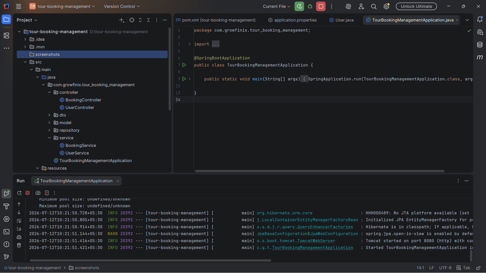

---

## 👤 Create User

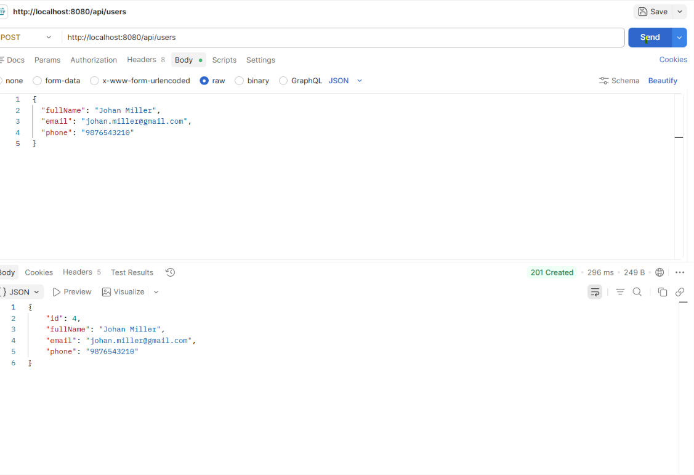

---

## 📋 Get All Users

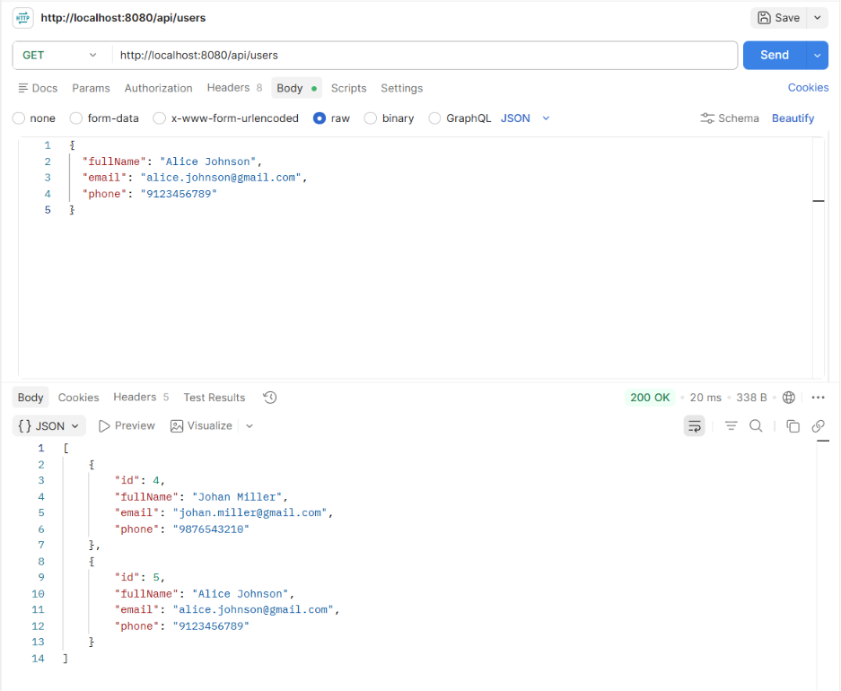

---

## 🔍 Custom Query - User By ID

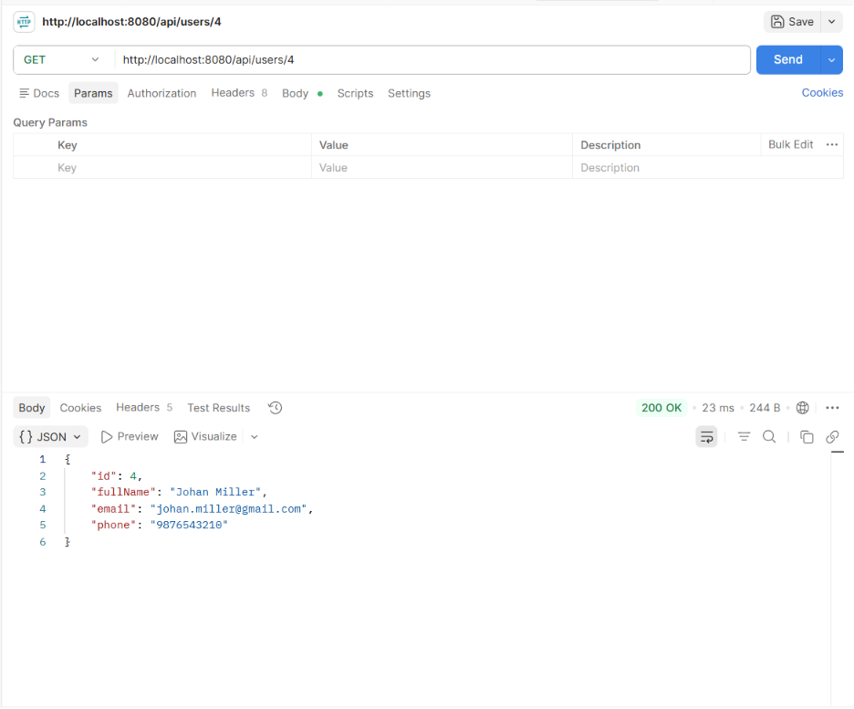

---

## ✏️ Update User

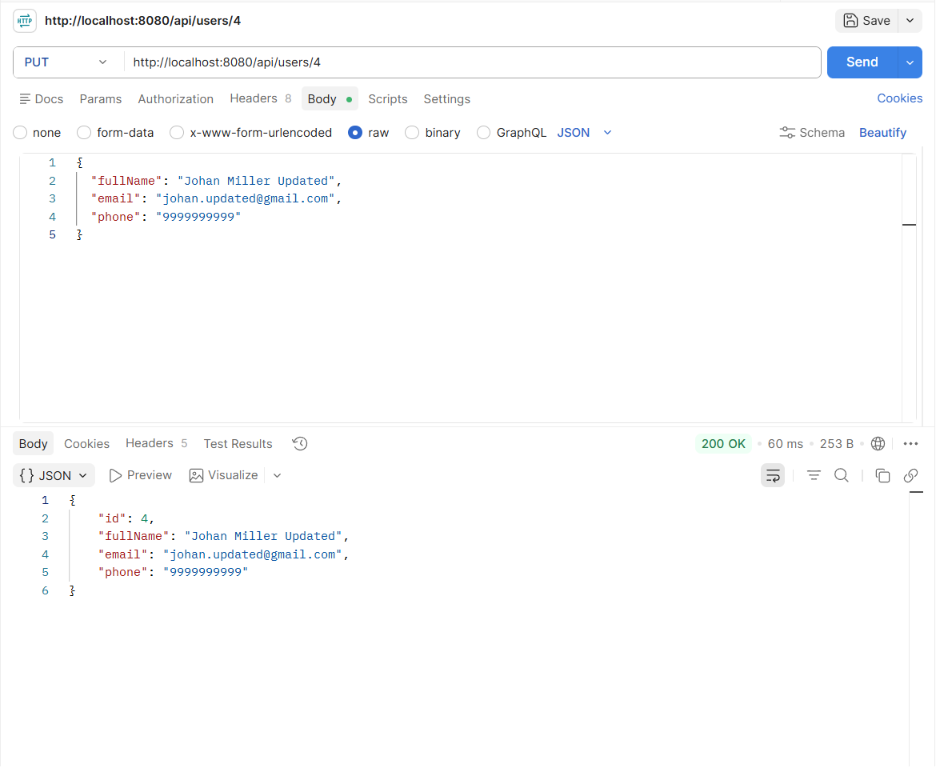

---

## 🗑️ Delete User

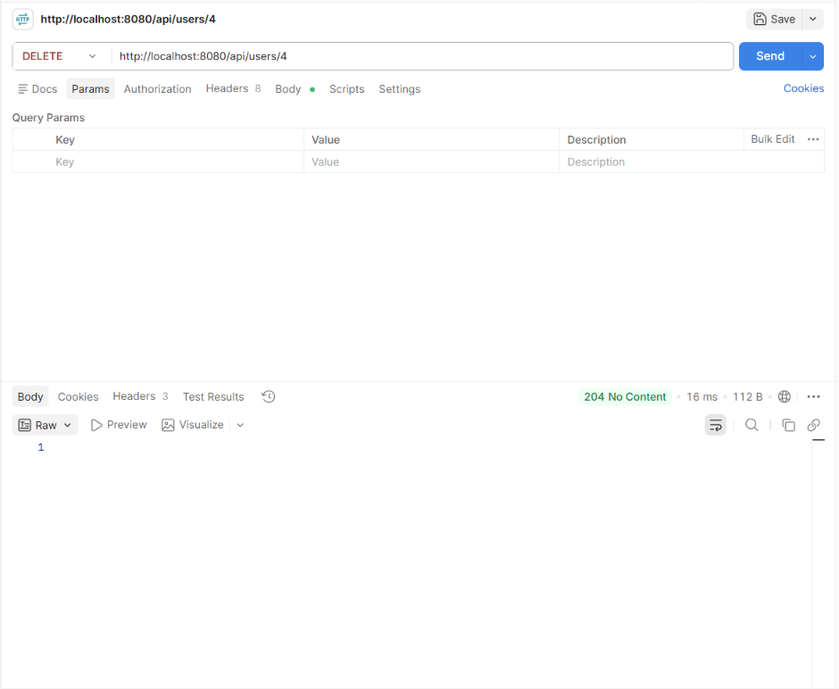

---

## 🧳 Get All Bookings

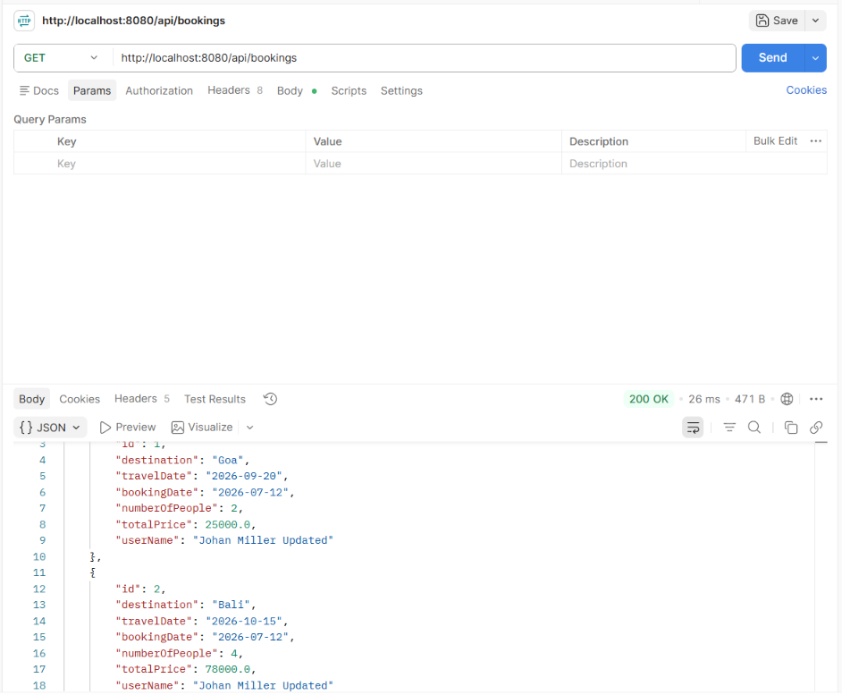

---

## 🔎 Search User by Email

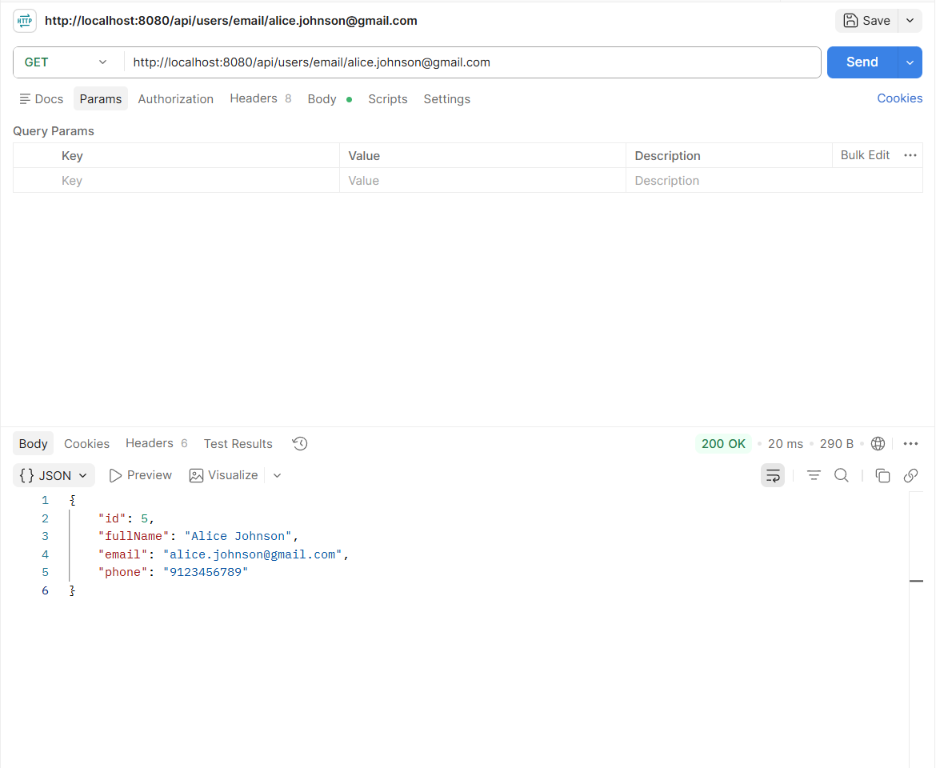

---

## 🌍 Search Booking by Destination

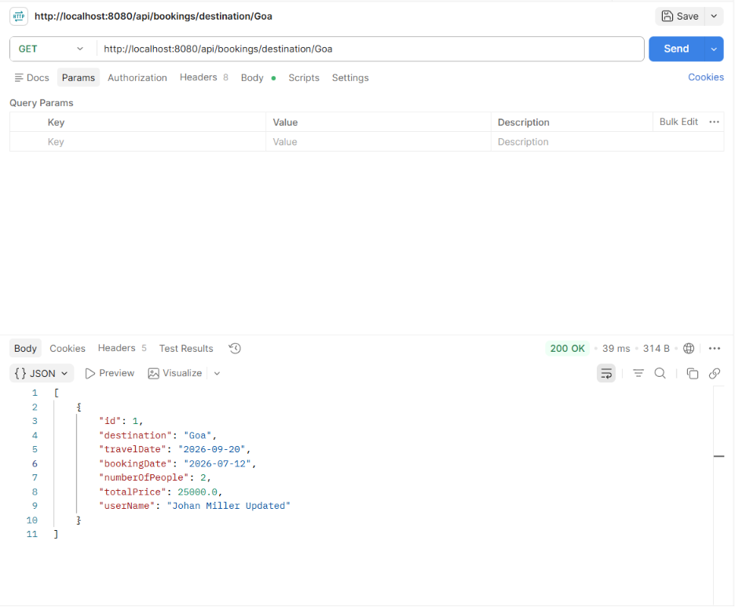

---

## ⚠️ Validation

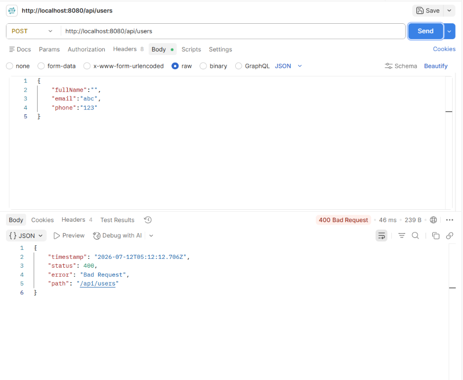

---

## 🗄️ User Table (PostgreSQL)

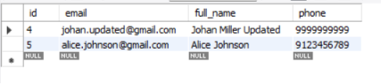

---

## 🗄️ Booking Table (PostgreSQL)

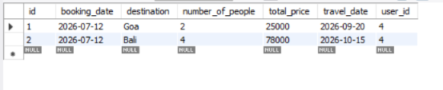

---

# 🎯 Learning Outcomes

Through this project, I gained hands-on experience with:

- Spring Boot REST API Development
- Spring Data JPA
- Hibernate ORM
- PostgreSQL Database
- One-to-Many & Many-to-One Mapping
- Repository Pattern
- CRUD Operations
- Bean Validation
- Custom Query Methods
- Postman API Testing

---

# 🔮 Future Improvements

- Global Exception Handling
- Spring Security
- JWT Authentication
- Swagger/OpenAPI Documentation
- Docker Deployment
- Unit & Integration Testing

---

# 👨‍💻 Author

**Manasi Magdum**

- 💼 LinkedIn: https://www.linkedin.com/in/manasi-magdum-bb4199291/
- 💻 GitHub: https://github.com/MagdumManasi

# 🙏 Acknowledgement

This project was developed as **Task 2** for the **Java Development Internship** at **Growfinix Technology**.

Special thanks to **Growfinix Technology** for providing an opportunity to learn and implement Spring Boot, Spring Data JPA, Hibernate, and PostgreSQL through practical tasks.
